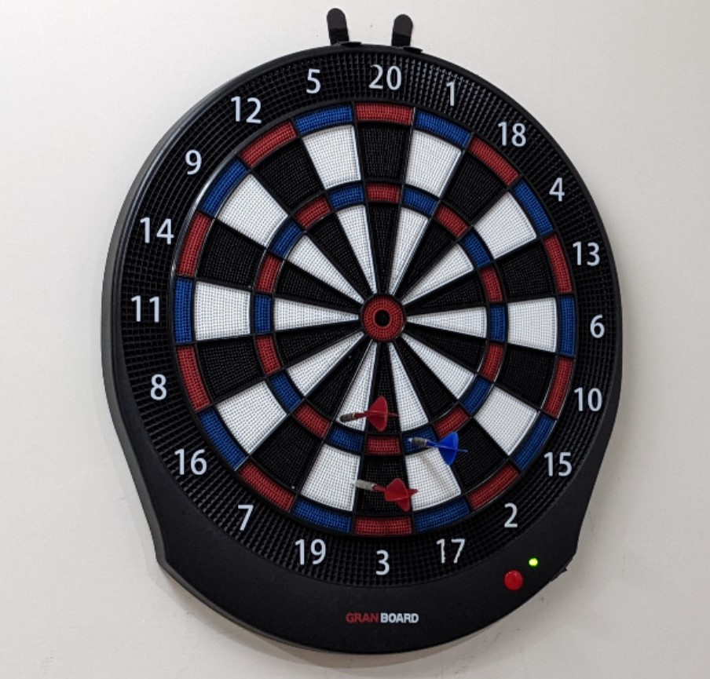
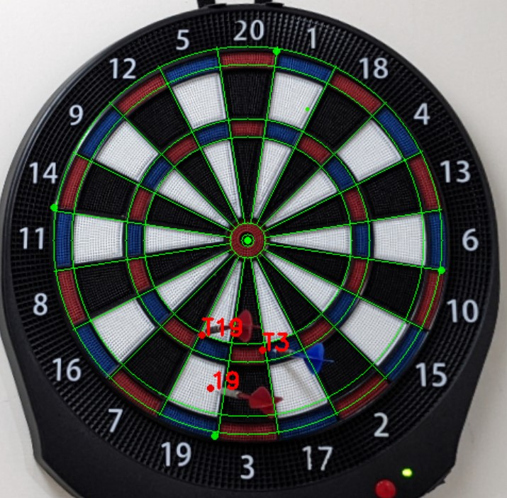

# DartScore

A real-time dart score detecting application using a single camera.
After trainning custom dataset for darknet yolov4 [(link)](https://github.com/RRRChangeche/cv-marathon). I've integrated darknet C++ API and trained yolov4-tiny model with my C++ project.

| Original | Calibrated + Score |
|-|-|
|||